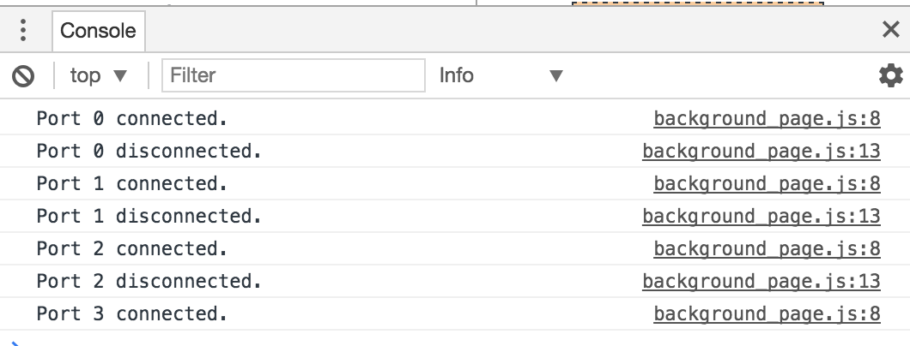
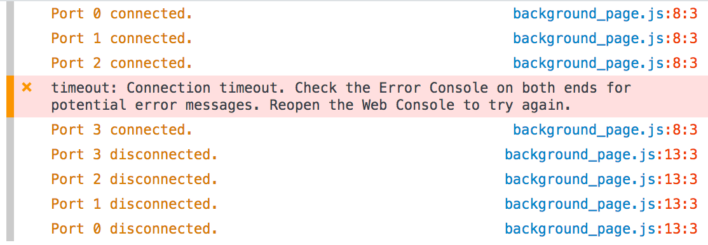

**Tested on Mac OSX 10.12.5 with Firefox 53.0.3 and Firefox Nightly 55.0a1**

This demonstrates how chrome and firefox differ in the way they dispatch chrome.runtime.port.onDisconnect.

* Chrome dispatches port.onDisconnect on EVERY page navigation

* Firefox dispatches port.onDisconnect only when you close the tab.

